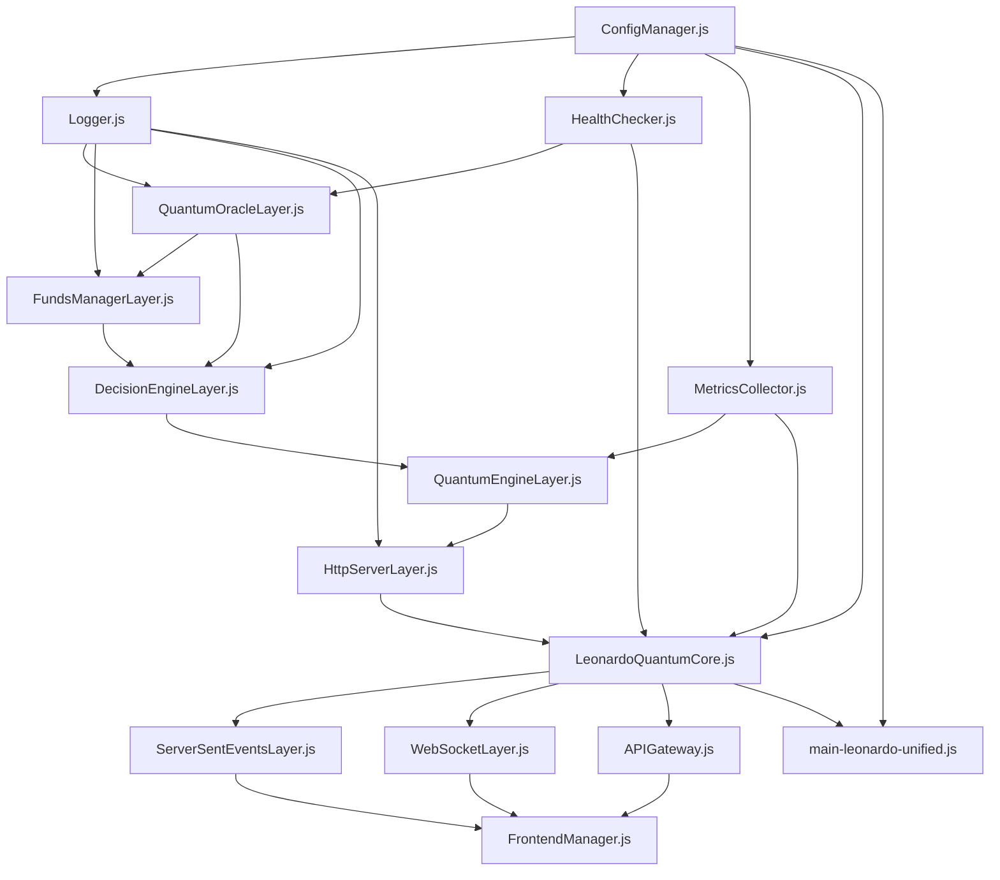

# 🏗️ PLAN DE IMPLEMENTACIÓN ARQUITECTÓNICA - FASE 1

## 📁 ESTRUCTURA DE DIRECTORIOS UNIFICADA

```
C:\Users\DELL\Desktop\QBTC-UNIFIED\
├── 🌟 leonardo-unified\                    # NUEVO NÚCLEO CONSOLIDADO
│   ├── core\
│   │   ├── LeonardoQuantumCore.js         # Núcleo principal consolidado
│   │   ├── HttpServerLayer.js             # Capa HTTP unificada
│   │   ├── QuantumEngineLayer.js          # Capa del motor cuántico
│   │   ├── DecisionEngineLayer.js         # Capa de decisiones Leonardo
│   │   ├── FundsManagerLayer.js           # Capa de gestión de fondos
│   │   └── QuantumOracleLayer.js          # Capa del oráculo cuántico
│   ├── interfaces\
│   │   ├── APIGateway.js                  # Gateway de APIs
│   │   ├── WebSocketLayer.js              # WebSockets
│   │   └── ServerSentEventsLayer.js       # Server-Sent Events
│   ├── config\
│   │   ├── leonardo-unified-config.json   # Configuración maestra
│   │   ├── ConfigManager.js               # Gestor de configuración
│   │   └── presets\                       # Presets de configuración
│   │       ├── conservative.json
│   │       ├── balanced.json
│   │       ├── aggressive.json
│   │       ├── big-bang.json
│   │       ├── production.json
│   │       └── development.json
│   ├── frontend\
│   │   └── FrontendManager.js             # Gestor de múltiples frontends
│   ├── utils\
│   │   ├── HealthChecker.js               # Verificador de salud del sistema
│   │   ├── Logger.js                      # Sistema de logging unificado
│   │   └── MetricsCollector.js            # Recolector de métricas
│   └── tests\
│       ├── unit\                          # Tests unitarios
│       ├── integration\                   # Tests de integración
│       └── performance\                   # Tests de rendimiento
├── 🚀 main-leonardo-unified.js            # SCRIPT MAESTRO PRINCIPAL
├── 📋 scripts\                            # Scripts especializados reorganizados
│   ├── test-unified-system.js             # Testing completo
│   ├── migrate-from-old-system.js         # Migración desde sistema anterior
│   └── health-monitor.js                  # Monitor de salud standalone
├── 🗂️ legacy\                             # ARCHIVOS ANTIGUOS (Para referencia temporal)
│   ├── quantum-core\                      # Movido desde raíz
│   ├── leonardo-consciousness\            # Movido desde raíz
│   ├── production\                        # Movido desde raíz
│   └── deprecated-scripts\                # Scripts antiguos
└── 📚 docs\                               # Documentación unificada
    ├── api-reference.md
    ├── configuration-guide.md
    ├── migration-guide.md
    └── troubleshooting.md
```

## 📋 ORDEN DE CREACIÓN - FASE 1

### PASO 1: Configuración Base
```bash
# Ubicación: C:\Users\DELL\Desktop\QBTC-UNIFIED\leonardo-unified\config\
```
1. `leonardo-unified-config.json` - Configuración maestra
2. `ConfigManager.js` - Gestor de configuración
3. Presets de configuración (6 archivos JSON)

### PASO 2: Utilidades Base
```bash
# Ubicación: C:\Users\DELL\Desktop\QBTC-UNIFIED\leonardo-unified\utils\
```
4. `Logger.js` - Sistema de logging unificado
5. `HealthChecker.js` - Verificador de salud
6. `MetricsCollector.js` - Recolector de métricas

### PASO 3: Capas del Núcleo (En orden de dependencias)
```bash
# Ubicación: C:\Users\DELL\Desktop\QBTC-UNIFIED\leonardo-unified\core\
```
7. `QuantumOracleLayer.js` - Sin dependencias externas
8. `FundsManagerLayer.js` - Depende de QuantumOracle
9. `DecisionEngineLayer.js` - Depende de FundsManager y QuantumOracle
10. `QuantumEngineLayer.js` - Depende de DecisionEngine
11. `HttpServerLayer.js` - Depende de QuantumEngine
12. `LeonardoQuantumCore.js` - Integra todas las capas

### PASO 4: Interfaces de Comunicación
```bash
# Ubicación: C:\Users\DELL\Desktop\QBTC-UNIFIED\leonardo-unified\interfaces\
```
13. `ServerSentEventsLayer.js` - Manejo de SSE
14. `WebSocketLayer.js` - Manejo de WebSockets
15. `APIGateway.js` - Gateway principal de APIs

### PASO 5: Gestión de Frontend
```bash
# Ubicación: C:\Users\DELL\Desktop\QBTC-UNIFIED\leonardo-unified\frontend\
```
16. `FrontendManager.js` - Gestor de múltiples frontends

### PASO 6: Script Maestro
```bash
# Ubicación: C:\Users\DELL\Desktop\QBTC-UNIFIED\
```
17. `main-leonardo-unified.js` - Punto de entrada principal

## 🔗 MAPA DE DEPENDENCIAS



## 🎯 PRINCIPIOS DE MIGRACIÓN

### ✅ FUENTES DE CONSOLIDACIÓN
**Origen de cada capa:**

1. **HttpServerLayer.js**:
   - `C:\Users\DELL\Desktop\QBTC-UNIFIED\quantum-core\UnifiedHttpServer.js` (principal)
   - `C:\Users\DELL\Desktop\QBTC-UNIFIED\leonardo-consciousness\UnifiedLeonardoServer.js` (funcionalidad HTTP)
   - `C:\Users\DELL\Desktop\QBTC-UNIFIED\production\qbtc-unified-server.js` (endpoints básicos)

2. **QuantumEngineLayer.js**:
   - `C:\Users\DELL\Desktop\QBTC-UNIFIED\quantum-core\QuantumUnifiedCore.js` (principal)
   - `C:\Users\DELL\Desktop\QBTC-UNIFIED\VigoFutures\core\quantum-engine\QuantumUnifiedCore.js`
   - `C:\Users\DELL\Desktop\QBTC-UNIFIED\VigoFutures\quantum-core\QuantumUnifiedCore.js`

3. **DecisionEngineLayer.js**:
   - `C:\Users\DELL\Desktop\QBTC-UNIFIED\leonardo-consciousness\LeonardoDecisionEngine.js` (completo)

4. **FundsManagerLayer.js**:
   - `C:\Users\DELL\Desktop\QBTC-UNIFIED\leonardo-consciousness\FundsManager.js` (completo)

5. **QuantumOracleLayer.js**:
   - `C:\Users\DELL\Desktop\QBTC-UNIFIED\quantum-oracle-hypersphere\QuantumOracleHypersphere.js`

### 🚫 EVITAR DUPLICACIONES
- **NO crear** en directorios existentes hasta completar migración
- **NO modificar** archivos originales hasta que el nuevo sistema funcione
- **USAR rutas absolutas** en todas las importaciones
- **MANTENER** archivos originales en `/legacy/` como respaldo

### 📁 RUTAS ABSOLUTAS ESTÁNDAR
```javascript
// Ejemplo de importaciones con rutas absolutas
const ConfigManager = require('C:\\Users\\DELL\\Desktop\\QBTC-UNIFIED\\leonardo-unified\\config\\ConfigManager');
const Logger = require('C:\\Users\\DELL\\Desktop\\QBTC-UNIFIED\\leonardo-unified\\utils\\Logger');
const LeonardoQuantumCore = require('C:\\Users\\DELL\\Desktop\\QBTC-UNIFIED\\leonardo-unified\\core\\LeonardoQuantumCore');
```

## 🚀 CRONOGRAMA DETALLADO - FASE 1

### Día 1: Configuración y Utilidades Base (Pasos 1-6)
- ⏰ 2-3 horas
- 🎯 Crear fundamentos sólidos
- ✅ Configuración + Logger + HealthChecker + Metrics

### Día 2: Núcleo Cuántico (Pasos 7-12)  
- ⏰ 4-5 horas
- 🎯 Consolidar todas las implementaciones cuánticas
- ✅ 6 capas del núcleo en orden de dependencias

### Día 3: Interfaces y Script Maestro (Pasos 13-17)
- ⏰ 3-4 horas  
- 🎯 Completar comunicación y punto de entrada
- ✅ APIs + WebSockets + Frontend + Script principal

---

**¿Procedo con el PASO 1 creando la configuración maestra `leonardo-unified-config.json`?**
