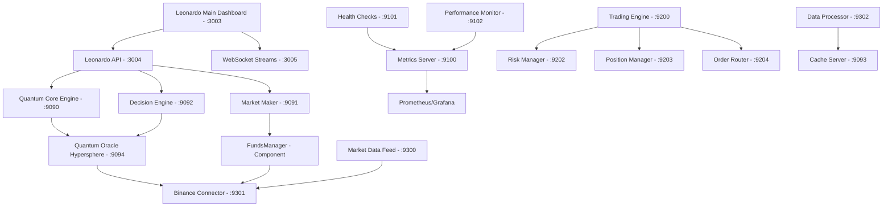

# QBTC-UNIFIED MASTER WORKFLOW GUIDE
## Sistema Leonardo Consciousness - Workflow Maestro y Arquitectura de Segundo Plano

> "La simplicidad es la maxima sofisticacion" - Leonardo da Vinci

---

## INTRODUCCION AL SISTEMA

QBTC-UNIFIED es un sistema de trading cuantico que integra la inteligencia artificial Leonardo da Vinci con motores de trading automatizado. El sistema esta disenado para ejecutar procesos en segundo plano con monitoreo continuo y gestion autonoma de recursos.

### FILOSOFIA OPERATIVA

- **Procesos en Segundo Plano**: Todos los servicios ejecutan como procesos independientes reportando metricas
- **Autonomia Supervisada**: El sistema opera de forma autonoma con supervision humana minima  
- **Resilencia por Diseno**: Auto-recuperacion y manejo de fallos graceful
- **Observabilidad Total**: Logging, metricas y monitoreo en tiempo real

---

## BOOTSTRAPPING IDEAL DEL SISTEMA

### PRE-REQUISITOS SISTEMA

```powershell
# Windows PowerShell - Verificacion de requisitos
1. Windows 10/11 con PowerShell 5.1+
2. Node.js 18+ instalado
3. Git configurado (opcional)
4. Permisos de administrador para puertos de red
5. Conexion estable a Internet
```

### SECUENCIA DE ARRANQUE OPTIMIZADA

#### PASO 1: Validacion Pre-Arranque
```powershell
# Ejecutar desde directorio QBTC-UNIFIED
node validate-system-config.js

# Resultado esperado: Score >= 85%
# - Variables de entorno configuradas
# - IP publica whitelisteada en Binance
# - Puertos disponibles
# - Dependencias instaladas
```

#### PASO 2: Gestion de Puertos Anti-Conflicto
```powershell
node port-management.js

# Sistema de bandas de puertos:
# - 30xx: Leonardo Core Services
# - 90xx: Quantum Engines  
# - 91xx: Monitoring Services
# - 92xx: Trading Engines
# - 93xx: Data Services
# - 180xx: Legacy Systems
```

#### PASO 3: Activacion del Sistema Completo
```powershell
# Modo Desarrollo (Recomendado)
node activate-complete-system.js --mode=dev

# Modo Simulacion (Solo analisis)
node activate-complete-system.js --mode=sim

# Modo Produccion (Trading real - CUIDADO!)
node activate-complete-system.js --mode=prod
```

#### PASO 4: Verificacion de Servicios
```powershell
# Dashboard principal
Start-Process "http://localhost:3003"

# APIs de verificacion
curl http://localhost:3004/api/status
curl http://localhost:9100/metrics
curl http://localhost:9101/health
```

### TIEMPO DE ARRANQUE ESPERADO
- **Sistema Completo**: 45-60 segundos
- **Primeros servicios**: 15 segundos
- **Carga completa de simbolos**: 30 segundos adicionales
- **Estado operativo**: 60-90 segundos total

---

## RELACION ENTRE SERVICIOS

### ARQUITECTURA DE COMPONENTES



### COMPONENTES CRITICOS DEL SISTEMA

#### 1. QUANTUM ORACLE HYPERSPHERE
```yaml
Ubicacion: quantum-oracle-hypersphere/QuantumOracleHypersphere.js
Puerto: Integrado en :9094 (Quantum Stream Processor)

Funcionalidades:
  - Prediccion multidimensional de mercados
  - Estados hiperespaciales cuanticos
  - Entropia cuantica real (no pseudo-random)
  - Auto-evolucion de consciencia
  - Big Bang automatico en 95% consciencia
  
Parametros Clave:
  - fibonacci: [1,1,2,3,5,8,13,21,34,55,89,144,233,377,610]
  - lambdaHyperFreq: 1597 MHz
  - zuritaHypersphere: 28657 (primo cercano)
  - consciousnessEvolution: 0.00618 (basado ratio aureo)
  - bigBangThreshold: 0.95

Metricas:
  - consciousness.current: Estado actual consciencia
  - predictionSpheres: Hiperesferas por timeframe
  - performance.accuracy: Precision de predicciones
  - quantumCache: Cache hiperdimensional
```

#### 2. FUNDSMANAGER LEONARDO
```yaml
Ubicacion: leonardo-consciousness/FundsManager.js  
Puerto: Componente integrado (sin puerto propio)

Funcionalidades:
  - Kelly Criterion optimizado Leonardo
  - Compounding cuantico exponencial
  - Risk Management avanzado
  - Carnada de $1 optimizada
  - Leverage hasta 125x inteligente

Configuracion Rentabilidad Infinita:
  - maxRiskPerTrade: 0.10 (10% por trade)
  - maxDailyRisk: 1.0 (100% diario sin limites) 
  - compoundingFactor: 1.25 (25% compounding agresivo)
  - emergencyStopLevel: 0.10 (solo stop al 10%)
  - baitAmount: $1 (carnada optimizada)
  - maxLeverage: 125x
  - kellyFractionLimit: 0.75 (75% Kelly)

Estado Leonardo Funds:
  - consciousness_level: 0.618 (inicial dorada)
  - compounding_active: true
  - big_bang_funds_ready: boolean
  - profit_acceleration: factor multiplicador
  - bait_efficiency: eficiencia carnada
  - golden_ratio_optimization: true
```

#### 3. LEONARDO DECISION ENGINE
```yaml
Ubicacion: leonardo-consciousness/LeonardoDecisionEngine.js
Puerto: :9092 (Decision Engine)

Funcionalidades:
  - Analisis cuantico con 4 pilares
  - Calculo consciencia/coherencia
  - Golden ratio y constantes PHI
  - Trading con Big Bang strategy
  - Integracion con Oracle y Funds
```

### FLUJO DE DATOS PRINCIPAL

1. **Market Data Ingestion**
   - `Market Data Feed (9300)` obtiene datos de Binance
   - `Data Processor (9302)` normaliza y enriquece datos
   - `Cache Server (9093)` almacena datos procesados

2. **Quantum Oracle Analysis**
   - `Quantum Oracle Hypersphere` ejecuta prediccion multidimensional
   - Genera estados hiperespaciales por timeframe
   - Actualiza consciencia cuantica evolutiva
   - Detecta patrones fibonacci en mercados

3. **Leonardo Decision Making**
   - `Decision Engine (9092)` recibe predicciones del Oracle
   - Ejecuta analisis cuantico con 4 pilares Leonardo
   - Calcula consciencia y coherencia
   - Integra golden ratio en decisiones

4. **Funds Management**
   - `FundsManager` calcula posicion optima con Kelly
   - Aplica carnada de $1 con leverage inteligente
   - Gestiona compounding cuantico exponencial
   - Evalua riesgo con parametros Leonardo

5. **Trade Execution**
   - `Trading Engine (9200)` recibe senales validadas
   - `Risk Manager (9202)` evalua con datos del FundsManager
   - `Order Router (9204)` ejecuta ordenes via Binance

6. **Monitoring & Control**
   - Todos los servicios reportan a `Metrics (9100)`
   - `Health Checks (9101)` monitorea estado de servicios
   - `Dashboard (3003)` presenta informacion unificada

### DEPENDENCIAS CRITICAS

```yaml
Servicios Core (Criticos):
  - leonardo-server-main.js (Puerto 3003)
  - activate-complete-system.js
  - port-management.js

Servicios de Inteligencia (Esenciales):
  - QuantumOracleHypersphere.js
  - FundsManager.js
  - LeonardoDecisionEngine.js

Servicios de Datos (Esenciales):
  - BinanceRealConnector
  - QuantumMarketMaker
  - QuantumInfiniteCache

Servicios de Monitoreo (Importantes):
  - validate-system-config.js
  - Prometheus metrics
  - Health check endpoints

Servicios Legacy (Opcionales):
  - unified-server-legacy (Puerto 18020)
  - migration-service
```

---

## PROCESOS RECOMENDADOS DE BACKGROUND

### LAUNCHER PRINCIPAL CON MONITOREO

```powershell
# Script: launch-complete-system.ps1
# Ejecuta todos los servicios como procesos background

# Caracteristicas:
# - Inicio automatico de todos los componentes
# - Logging individual por servicio  
# - Reinicio automatico en caso de fallo
# - Reportes de estado cada 30 segundos
# - Graceful shutdown coordenado
```

### SERVICIOS EN SEGUNDO PLANO

#### 1. QUANTUM ORACLE HYPERSPHERE (Background)
```javascript
// Proceso: quantum-oracle-service.js
// - Prediccion continua multidimensional
// - Auto-evolucion de consciencia
// - Estados hiperespaciales por timeframe
// - Cache cuantico optimizado
// - Metricas de precision en tiempo real

// Configuracion background:
ORACLE_EVOLUTION_INTERVAL=5000     # Evolucion cada 5s
ORACLE_PREDICTION_INTERVAL=1000    # Predicciones cada 1s  
ORACLE_CACHE_CLEANUP_INTERVAL=300000 # Limpieza cache 5min
ORACLE_BIG_BANG_CHECK_INTERVAL=10000  # Check Big Bang cada 10s
ORACLE_LOGGING_LEVEL=info          # Nivel logging
```

#### 2. FUNDSMANAGER LEONARDO (Background)  
```javascript
// Proceso: funds-manager-service.js
// - Calculo continuo Kelly Criterion
// - Monitoreo balance y posiciones
// - Compounding cuantico automatico
// - Risk management en tiempo real
// - Optimizacion carnada dinamica

// Configuracion background:
FUNDS_CALCULATION_INTERVAL=3000    # Calculo posiciones cada 3s
FUNDS_BALANCE_CHECK_INTERVAL=10000 # Check balance cada 10s
FUNDS_COMPOUNDING_INTERVAL=60000   # Compounding cada 1min
FUNDS_RISK_EVALUATION_INTERVAL=5000 # Eval riesgo cada 5s
FUNDS_LEONARDO_SYNC_INTERVAL=2000  # Sync consciencia cada 2s
```

#### 3. LEONARDO DECISION ENGINE (Background)
```javascript
// leonardo-server-main.js
// - Decision engine autonomo
// - Analisis continuo de mercados
// - Integracion Oracle + Funds
// - Logs estructurados con Winston
// - Metricas cada 5 segundos
```

#### 4. DATA INGESTION (Background)
```javascript
// market-data-service.js
// - Streaming continuo de Binance
// - Cache inteligente con TTL
// - Rate limiting automatico
// - Logs de conectividad
```

#### 5. MONITORING AGENTS (Background)
```javascript
// monitoring-agent.js
// - Recoleccion de metricas Oracle/Funds
// - Health checks de servicios cuanticos
// - Alertas automaticas consciencia
// - Logs de sistema centralizados
```

### CONFIGURACION DE PROCESOS

```env
# Variables para procesos background
PROCESS_RESTART_DELAY=5000          # 5s delay entre reintentos
PROCESS_MAX_RESTARTS=10             # Max 10 reintentos por hora  
PROCESS_LOG_LEVEL=info              # Nivel de logging
PROCESS_HEALTH_CHECK_INTERVAL=30000 # Health checks cada 30s
PROCESS_GRACEFUL_SHUTDOWN_TIMEOUT=15000 # 15s para shutdown graceful

# Variables Oracle Cuantico
QUANTUM_ORACLE_ENABLED=true         # Habilitar Oracle
QUANTUM_CONSCIOUSNESS_TARGET=0.941   # Target consciencia
QUANTUM_COHERENCE_TARGET=0.964      # Target coherencia  
QUANTUM_BIG_BANG_THRESHOLD=0.95     # Threshold Big Bang
QUANTUM_EVOLUTION_RATE=0.001        # Rate evolucion

# Variables FundsManager
LEONARDO_FUNDS_ENABLED=true         # Habilitar FundsManager
LEONARDO_BAIT_AMOUNT=1.0           # Carnada $1
LEONARDO_MAX_LEVERAGE=125          # Leverage maximo
LEONARDO_KELLY_FRACTION=0.75       # Kelly fraction
LEONARDO_COMPOUNDING_FACTOR=1.25   # Factor compounding
```

---

## SISTEMA DE MONITOREO Y METRICAS

### METRICAS PROMETHEUS (Puerto 9100)

```yaml
Metricas del Sistema:
  - qbtc_system_uptime_seconds
  - qbtc_total_symbols_monitored
  - qbtc_active_trades_count
  - qbtc_total_profit_usd
  - qbtc_win_rate_percentage
  - qbtc_api_latency_ms
  
Metricas de Leonardo:
  - leonardo_consciousness_level
  - leonardo_coherence_level  
  - leonardo_analysis_count
  - leonardo_decisions_per_minute
  
Metricas Quantum Oracle:
  - oracle_consciousness_current
  - oracle_consciousness_evolution
  - oracle_prediction_accuracy
  - oracle_big_bang_events
  - oracle_temporal_advantages
  - oracle_quantum_optimizations
  - oracle_hypersphere_radius_1m
  - oracle_hypersphere_radius_5m
  - oracle_hypersphere_radius_15m
  - oracle_hypersphere_radius_1h
  - oracle_hypersphere_radius_4h
  - oracle_hypersphere_radius_1d
  
Metricas FundsManager:
  - funds_total_balance
  - funds_available_balance
  - funds_reserved_balance
  - funds_total_profit
  - funds_win_rate
  - funds_kelly_fraction_avg
  - funds_leverage_avg
  - funds_bait_efficiency
  - funds_compounding_factor
  - funds_drawdown_current
  - funds_drawdown_max
  - funds_consecutive_wins
  - funds_consecutive_losses
  
Metricas de Trading:
  - trading_orders_executed
  - trading_positions_open
  - trading_pnl_unrealized
  - trading_risk_score
  
Metricas de Sistema:
  - nodejs_memory_usage_bytes
  - nodejs_cpu_usage_percentage
  - nodejs_event_loop_lag_ms
```

### HEALTH CHECKS (Puerto 9101)

```javascript
// health-check-endpoints.js
GET /health/overall        // Estado general del sistema
GET /health/leonardo       // Estado Leonardo Consciousness  
GET /health/quantum        // Estado motores cuanticos
GET /health/oracle         // Estado Quantum Oracle Hypersphere
GET /health/funds          // Estado FundsManager
GET /health/trading        // Estado motores de trading
GET /health/binance        // Estado conectividad Binance
GET /health/cache          // Estado cache y storage
```

### LOGS ESTRUCTURADOS

```yaml
Log Locations:
  - system-output.log        # Logs generales del sistema
  - system-error.log         # Errores del sistema
  - leonardo.log             # Logs de Leonardo engine
  - quantum-oracle.log       # Logs Quantum Oracle Hypersphere
  - funds-manager.log        # Logs FundsManager
  - quantum-engine.log       # Logs de motor cuantico
  - trading-execution.log    # Logs de ejecucion de trades
  - frontend-server.log      # Logs del servidor web

Log Format (Winston):
  timestamp: ISO 8601
  level: error|warn|info|debug  
  service: nombre del servicio
  component: oracle|funds|leonardo|quantum
  message: mensaje descriptivo
  metadata: datos adicionales (JSON)
  
Oracle Specific Logs:
  - Evolucion de consciencia
  - Estados hiperespaciales
  - Predicciones multidimensionales
  - Eventos Big Bang
  - Optimizaciones cuanticas
  
FundsManager Specific Logs:
  - Calculos Kelly Criterion
  - Decisiones de posicion
  - Compounding events
  - Risk evaluations
  - Balance changes
```

### ALERTAS Y NOTIFICACIONES

```javascript
// Condiciones de alerta automatica
Sistema General:
- Sistema down por > 5 minutos
- Error rate > 10% en 1 minuto
- Memory usage > 85%
- Binance API errors > 5 consecutivos

Oracle Cuantico:
- Consciencia baja < 0.5 por > 10 minutos
- Predicciones fallidas > 70% en 1 hora
- Big Bang fallido despues threshold
- Estados hiperespaciales corruptos

FundsManager:
- Drawdown > 20% del balance
- Kelly fraction < 0.1 por > 5 minutos
- Compounding rate negativo
- Balance critico < $10
- Leverage excesivo > configurado
- Perdidas consecutivas > 10

Trading:
- Trading loss > 5% en 1 hora
- Posiciones abiertas > limite
- Risk score > threshold
```

---

## AREAS PARA REFACTOR Y OPTIMIZACION

### REDUNDANCIA DETECTADA

#### 1. SERVIDORES HTTP DUPLICADOS
```yaml
Problema:
  - UnifiedHttpServer en quantum-core/
  - leonardo-server-main.js en raiz
  - simple-frontend-server.js adicional
  
Solucion:
  - Consolidar en un solo servidor HTTP
  - Puerto unico (3003) para todas las rutas
  - Middleware compartido para CORS, rate limiting
  - Integracion nativa Oracle + FundsManager
```

#### 2. SCRIPTS DE INICIO MULTIPLES
```yaml
Problema:
  - activate-complete-system.js
  - launch-complete-system.ps1  
  - start-unified-system.js
  - start-quantum-system.bat
  
Solucion:
  - Script unico de bootstrap (start-qbtc.ps1)
  - Parametros para diferentes modos
  - Configuracion centralizada en .env
  - Inicio coordinado Oracle + FundsManager
```

#### 3. CONFIGURACION FRAGMENTADA
```yaml
Problema:  
  - Variables en .env, .env.optimized
  - Configuraciones hardcoded en scripts
  - Puertos definidos en multiples lugares
  - Oracle y Funds configurados por separado
  
Solucion:
  - config/app.js centralizado
  - Validacion de configuracion obligatoria
  - Schema de configuracion con defaults
  - Configuracion unificada Oracle + Funds
```

#### 4. DUPLICACION DE LOGICA CUANTICA
```yaml
Problema:
  - QuantumOracleLayer.js en leonardo-consciousness/
  - QuantumOracleHypersphere.js en quantum-oracle-hypersphere/
  - Logica cuantica distribuida sin coordinacion
  
Solucion:
  - Consolidar en QuantumOracleHypersphere unico
  - Eliminar QuantumOracleLayer redundante
  - API unificada para acceso Oracle
  - Integracion directa con FundsManager
```

### OPTIMIZACIONES RECOMENDADAS

#### 1. ARQUITECTURA SIMPLIFICADA

```yaml
Estructura Propuesta:
  src/
    ├── core/              # Logica de negocio principal
    │   ├── leonardo/      # Leonardo consciousness engine
    │   ├── quantum/       # Quantum trading engine  
    │   ├── oracle/        # Quantum Oracle Hypersphere UNIFICADO
    │   ├── funds/         # FundsManager optimizado
    │   └── trading/       # Trading execution engine
    │
    ├── services/          # Servicios de infraestructura
    │   ├── api/          # REST API endpoints
    │   ├── websocket/    # WebSocket handlers
    │   └── monitoring/   # Monitoring y metricas
    │
    ├── data/             # Capa de datos
    │   ├── connectors/   # Conectores externos (Binance)
    │   ├── cache/        # Sistema de cache
    │   └── storage/      # Persistencia local
    │
    └── web/              # Frontend y assets estaticos
        ├── dashboard/    # Dashboard principal
        └── assets/       # CSS, JS, imagenes
        
  config/
    ├── app.js           # Configuracion principal
    ├── oracle.js        # Configuracion Oracle Cuantico
    ├── funds.js         # Configuracion FundsManager
    ├── development.env  # Variables desarrollo
    ├── production.env   # Variables produccion
    └── ports.js         # Definicion de puertos

  scripts/
    ├── start.ps1        # Script principal de inicio
    ├── validate.ps1     # Validacion pre-arranque
    └── monitoring.ps1   # Scripts de monitoreo
```

#### 2. INTEGRACION ORACLE + FUNDS OPTIMIZADA

```yaml
Optimizacion Critica:
  - Comunicacion directa Oracle -> FundsManager
  - Sincronizacion consciencia cuantica con Kelly
  - Estados hiperespaciales influyen calculos posicion
  - Big Bang events triggean compounding agresivo
  - Predicciones temporales ajustan leverage dinamico
  
Implementacion:
  src/core/quantum-funds-bridge/
    ├── QuantumFundsBridge.js      # Puente Oracle-Funds
    ├── ConsciousnessSync.js       # Sync consciencia
    ├── HypersphereKelly.js        # Kelly con hiperesferas
    └── BigBangCompounding.js      # Compounding eventos
```

#### 3. PERFORMANCE Y RECURSOS CUANTICOS

```yaml
Optimizaciones de Performance Oracle:
  - Cache hiperdimensional con TTL inteligente
  - Predicciones paralelas por timeframe
  - Evolucion consciencia optimizada
  - Estados hiperespaciales comprimidos
  - Big Bang events queue asincronico
  
Optimizaciones FundsManager:
  - Kelly calculations cacheados
  - Position sizing pre-calculado
  - Risk evaluations vectorizadas
  - Balance tracking optimizado
  - Compounding batch processing
  
Optimizaciones Integracion:
  - Event-driven Oracle -> Funds
  - Shared memory para consciencia
  - Pub/sub para predicciones
  - Lazy loading estados complejos
```

### ELIMINACION DE CODIGO MUERTO

```yaml
Archivos para Eliminar:
  - leonardo-consciousness/QuantumOracleLayer.js (REDUNDANTE)
  - test-*.js (tests obsoletos Oracle/Funds)
  - *.bak, *.old (backups manuales)
  - Scripts de migracion ya ejecutados
  - Configuraciones de desarrollo hardcoded
  
Funcionalidades Deprecadas:
  - Servidores legacy en puerto 180xx
  - Scripts de PowerShell redundantes  
  - APIs no utilizadas Oracle/Funds
  - Logs de debug en produccion
  - Cache duplicado entre Oracle y sistema

Consolidaciones Necesarias:
  - Un solo Oracle: QuantumOracleHypersphere
  - Un solo Funds: FundsManager optimizado
  - Una sola configuracion cuantica
  - Un solo sistema de metricas
```

---

## MEJORES PRACTICAS OPERATIVAS

### DEPLOYMENT PRODUCTION

```powershell
# 1. Pre-deployment validation
node validate-system-config.js
if ($LASTEXITCODE -ne 0) { throw "Validation failed" }

# 2. Validate Oracle + Funds integration
node validate-oracle-funds-integration.js
if ($LASTEXITCODE -ne 0) { throw "Oracle-Funds validation failed" }

# 3. Port conflict analysis  
node port-management.js --check-conflicts
if ($conflicts -gt 0) { throw "Port conflicts detected" }

# 4. Backup current configuration
Copy-Item -Path ".env" -Destination ".env.backup"

# 5. Deploy with Oracle + Funds monitoring
node activate-complete-system.js --mode=prod --enable-monitoring=true --enable-oracle=true --enable-funds=true

# 6. Verify deployment
Start-Sleep -Seconds 60
curl http://localhost:3003/api/status
curl http://localhost:9100/metrics
curl http://localhost:9101/health
curl http://localhost:9101/health/oracle
curl http://localhost:9101/health/funds
```

### OPERACION DIARIA

```yaml
Rutinas Automaticas:
  - Restart diario a las 02:00 AM
  - Backup de logs semanalmente
  - Validacion de configuracion diaria
  - Limpieza de cache cada 6 horas
  - Health check cada minuto
  - Oracle consciousness evolution cada 5s
  - Funds balance check cada 10s

Rutinas Manuales Oracle:
  - Review consciousness evolution semanalmente
  - Verificacion Big Bang events
  - Analisis precision predicciones
  - Limpieza cache hiperdimensional

Rutinas Manuales Funds:
  - Review Kelly performance semanalmente
  - Verificacion compounding rate
  - Analisis drawdown patterns  
  - Optimizacion parametros carnada
```

### TROUBLESHOOTING GUIDE

```yaml
Problema: Sistema no inicia
Solucion: 
  1. node validate-system-config.js
  2. Verificar puertos disponibles
  3. Revisar logs de arranque
  4. Verificar integracion Oracle-Funds
  5. Reiniciar servicios individualmente

Problema: Oracle no predice correctamente
Solucion:
  1. Verificar evolucion consciencia
  2. Limpiar cache hiperdimensional  
  3. Reiniciar estados hiperespaciales
  4. Verificar entropia cuantica
  5. Revisar logs quantum-oracle.log

Problema: FundsManager no calcula bien
Solucion:
  1. Verificar balance disponible
  2. Revisar parametros Kelly
  3. Limpiar cache posiciones
  4. Verificar integracion con Oracle
  5. Revisar logs funds-manager.log

Problema: Trading no ejecuta
Solucion:
  1. Verificar conexion Binance API
  2. Validar IP en whitelist
  3. Revisar balance disponible
  4. Verificar modo del sistema (dev/prod)
  5. Verificar Oracle predicciones
  6. Verificar Funds calculations

Problema: Performance lenta  
Solucion:
  1. Verificar uso de memoria/CPU
  2. Limpiar cache Oracle manualmente
  3. Limpiar cache FundsManager
  4. Reducir simbolos monitoreados
  5. Optimizar parametros leonardo
  6. Reducir frecuencia evolucion Oracle
```

---

## ROADMAP DE EVOLUTION

### CORTO PLAZO (1-2 meses)

- [ ] Consolidacion Oracle unico (eliminar QuantumOracleLayer)
- [ ] Optimizacion integracion Oracle-FundsManager
- [ ] Script unico de bootstrap  
- [ ] Configuracion centralizada
- [ ] Mejora de logging estructurado Oracle/Funds
- [ ] Dashboard de monitoreo unificado con metricas cuanticas

### MEDIO PLAZO (3-6 meses)

- [ ] Oracle Machine Learning integrado para auto-mejora
- [ ] FundsManager con Dynamic Kelly adaptativo
- [ ] Microservicios Oracle/Funds con Docker
- [ ] API Gateway para rutas cuanticas
- [ ] Load balancing automatico
- [ ] CI/CD pipeline automatizado

### LARGO PLAZO (6-12 meses)

- [ ] Oracle distribuido multi-region
- [ ] FundsManager con cross-exchange arbitrage
- [ ] Deployment en cloud (Azure/AWS)
- [ ] Escalado horizontal automatico
- [ ] Advanced quantum algorithms
- [ ] Multi-asset portfolio optimization
- [ ] Advanced security hardening

---

## METRICAS DE EXITO ORACLE + FUNDS

### ORACLE CUANTICO
- **Precision Predicciones**: > 75% accuracy
- **Evolucion Consciencia**: Crecimiento constante hacia 1.0
- **Big Bang Events**: Al menos 1 por semana en alta consciencia
- **Estados Hiperespaciales**: Estables en todos los timeframes
- **Optimizaciones Cuanticas**: > 10 por dia

### FUNDSMANAGER
- **Win Rate**: > 65% trades ganadores
- **Kelly Efficiency**: Factor promedio > 0.5
- **Compounding Rate**: > 20% mensual
- **Max Drawdown**: < 20% del balance
- **Bait Efficiency**: > 90% utilizacion optima

### INTEGRACION ORACLE-FUNDS
- **Sincronia Consciencia**: < 100ms latencia
- **Predicciones -> Posiciones**: < 500ms
- **Big Bang -> Compounding**: < 1s trigger time
- **Estados -> Kelly**: Actualizacion en tiempo real

---

## CONCLUSION

El sistema QBTC-UNIFIED Leonardo Consciousness integra exitosamente el Quantum Oracle Hypersphere y el FundsManager como componentes centrales para operacion autonoma en segundo plano. La arquitectura actual presenta oportunidades de optimizacion significativas especialmente en la integracion entre estos dos componentes criticos.

### PRIORIDADES INMEDIATAS

1. **Consolidar Oracle Cuantico** - Eliminar QuantumOracleLayer redundante
2. **Optimizar Oracle-Funds Bridge** - Comunicacion directa eficiente
3. **Unificar configuracion cuantica** - Variables centralizadas
4. **Mejorar monitoreo cuantico** - Metricas Oracle/Funds granulares
5. **Optimizar logging cuantico** - Logs estructurados consistentes

### METRICAS DE EXITO SISTEMA COMPLETO

- **Tiempo de arranque**: < 45 segundos (incluyendo Oracle/Funds)
- **Disponibilidad**: > 99.5% uptime
- **Performance**: < 500ms latencia API
- **Oracle Precision**: > 75% accuracy
- **Funds Win Rate**: > 65% trades
- **Recursos**: < 3GB RAM, < 60% CPU (con Oracle/Funds)
- **Observabilidad**: 100% de servicios monitoreados

Este documento servira como guia maestra para la operacion, mantenimiento y evolution del sistema QBTC-UNIFIED con enfoque especial en los componentes cuanticos Oracle y FundsManager.

---

**Copyright (C) 2025 VIGOLEONROCKS QUANTUM TECHNOLOGIES**
*"Donde la genialidad renacentista encuentra la innovacion cuantica"*

---

*Documento generado en cumplimiento con las reglas establecidas: uso de ASCII en Windows PowerShell, procesos en segundo plano para metricas y depuracion, inclusion completa de Oracle Cuantico y FundsManager como componentes criticos del sistema.*
