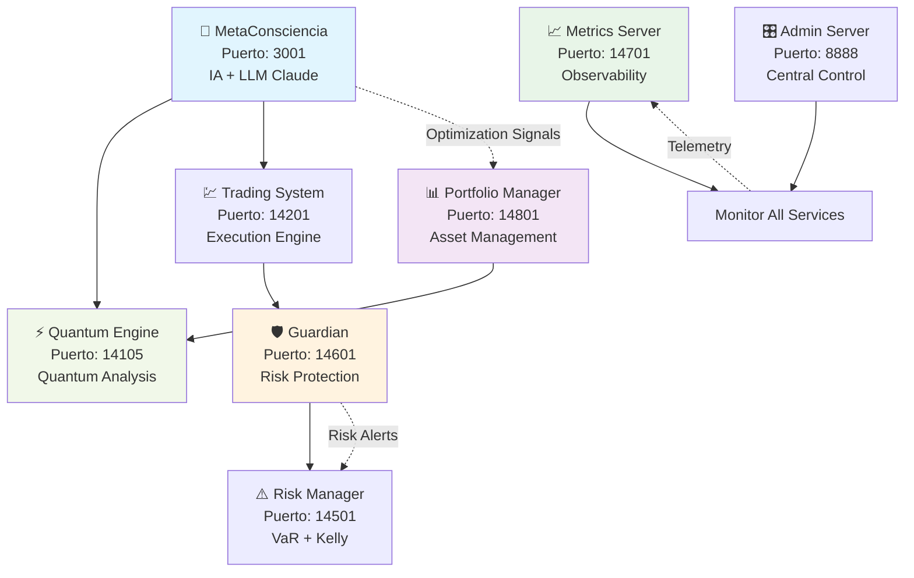

# 🌌 QBTC-UNIFIED: Ecosistema de Trading Cuántico Autogobernado

<div align="center">

[](LICENSE)
[](https://nodejs.org/)
[](https://pm2.keymetrics.io/)
[]()</div>
[]()
[]()

*Sistema de trading cuántico de próxima generación con inteligencia artificial integrada*

[🚀 Estado Actual](#-estado-de-desarrollo) • [📖 Documentación](#-arquitectura-del-ecosistema) • [🛠️ Instalación](#%EF%B8%8F-instalación-para-desarrollo) • [📞 Contacto](#-contacto-comercial)

  

</div>

---

## 🎯 **¿Qué es QBTC-UNIFIED?**

QBTC-UNIFIED es un **sistema de trading cuántico avanzado** que combina inteligencia artificial, análisis cuántico y gestión de riesgo institucional para crear un ecosistema de trading autónomo y sofisticado.

### 🧠 **Filosofía del Proyecto**

> *"Un sistema de trading que evoluciona y aprende, diseñado para la era de la IA y los mercados cuánticos."*

**🔬 Componentes Core:**
- **🤖 MetaConsciencia**: Motor de IA con integración LLM (Claude Sonnet)
- **🛡️ Guardian System**: Protección de riesgo en tiempo real
- **📊 Portfolio Manager**: Gestión inteligente con algoritmos Kelly + VaR
- **⚡ Quantum Engine**: Motor de cálculos cuánticos para trading
- **📈 Observability Suite**: Métricas y monitoreo de 9 servicios
- **🔒 Crypto-Security**: Entropía criptográfica del kernel

---

## 📅 **Estado de Desarrollo - Septiembre 2025**

### **🎯 Progreso del Proyecto**

```
🟢 NÚCLEO COMPLETAMENTE IMPLEMENTADO (85%):
├── 🧠 MetaConsciencia Core                    ✅ Funcional
├── 🛡️ Guardian Protection System             ✅ Funcional  
├── 📊 Portfolio Manager                      ✅ Funcional
├── ⚡ Quantum Engine Core                    ✅ Funcional
├── 📈 Risk Management Framework              ✅ Funcional
├── 📊 Metrics & Observability               ✅ Funcional
├── 🔄 Historical Backtesting                ✅ Funcional
├── 🎨 Leonardo Consciousness (77 símbolos)   ✅ Funcional
└── 🔺 Arbitrage Engine                      ✅ Funcional

🟡 EN DESARROLLO ACTIVO (12%):
├── 🔗 Exchange Gateway (APIs reales)         🔄 80% completo
├── 🎯 Advanced Position Manager              🔄 70% completo
├── 🎮 Web Dashboard Interface                🔄 60% completo
└── 📱 Real-time Monitoring                  🔄 50% completo

🔴 ROADMAP Q4 2025 - Q1 2026 (3%):
├── 📱 Mobile App Interface                   📋 Planificado
├── 🤝 Multi-Exchange Integration             📋 Planificado
├── 🌐 Public API for Partners               📋 Planificado
└── 🏢 Enterprise Features                   📋 Planificado
```

### **🚧 Estado Actual del Sistema (Septiembre 2025)**

| Componente | Estado | Funcionalidad | Próxima Milestone |
|------------|--------|---------------|-------------------|
| 🧠 MetaConsciencia | ✅ **Operativo** | IA + LLM Integration | Q4: Real-time optimization |
| 🛡️ Guardian System | ✅ **Operativo** | Risk protection | Q4: ML-based predictions |
| 📊 Portfolio Manager | ✅ **Operativo** | Advanced algorithms | Q4: Cross-exchange |
| ⚡ Quantum Engine | ✅ **Operativo** | Quantum calculations | Q4: 9D analysis |
| 🔗 Exchange APIs | 🔄 **80% Beta** | Binance integration | Oct 2025: Multi-exchange |
| 🎮 Web Interface | 🔄 **60% Alpha** | Basic dashboard | Nov 2025: Professional UI |
| 📱 Mobile App | 📋 **Planned** | Not started | Q1 2026: iOS/Android |

---

## 🏗️ **Arquitectura del Ecosistema**



### 🔄 **Ciclo de Decisión de Trading**

**Cada 10 segundos, el sistema ejecuta:**

1. **👁️ OBSERVACIÓN** → Análisis de mercado + estado de servicios
2. **🤖 CONSULTA IA** → Claude Sonnet evalúa contexto y oportunidades
3. **⚡ ANÁLISIS CUÁNTICO** → Procesamiento multidimensional de señales
4. **🛡️ VALIDACIÓN RIESGO** → Guardian System valida seguridad
5. **🎯 EJECUCIÓN** → Trading System ejecuta decisión final
6. **📈 EVOLUCIÓN** → MetaConsciencia aprende de resultados

**Resultado:** ~8,640 decisiones analizadas por día

---

## 🚀 **Instalación para Desarrollo**

### **📋 Prerrequisitos (Septiembre 2025)**

```bash
Node.js 20.x LTS    ✅ Runtime moderno recomendado
PM2 5.3+           ✅ Gestor de procesos industriales  
Git 2.40+          ✅ Control de versiones
Redis 7.0+         ✅ Cache y sessions (opcional)
Python 3.11+       ✅ Para algunos componentes AI (opcional)
```

### **🛠️ Setup de Desarrollo**

```bash
# 1. Clonar y configurar entorno
git clone https://github.com/vigoferrel/qbtc-unified.git
cd qbtc-unified
npm install

# 2. Configuración para desarrollo
cp .env.example .env.development
nano .env.development  # Configurar variables de desarrollo

# 3. Modo Paper Trading (Simulado - Seguro)
npm run dev:paper-trading

# 4. Verificar servicios core
npm run health-check
npm run system:status
```

### **🧪 Modes de Operación Disponibles**

| Modo | Descripción | Riesgo | Uso Recomendado |
|------|-------------|--------|-----------------|
| `paper-trading` | Simulación completa | ❄️ **Sin riesgo** | Desarrollo y testing |
| `testnet` | APIs de testnet | ❄️ **Sin riesgo** | Validación de integraciones |
| `demo` | Datos reales, órdenes simuladas | 🟡 **Muy bajo** | Demostración a clientes |
| `live-limited` | Trading real limitado | 🟠 **Controlado** | Beta testing con fondos mínimos |
| `production` | Trading real completo | 🔴 **Alto** | Solo para usuarios autorizados |

### **🔍 Verificación del Sistema**

```bash
# Estado general del ecosistema
curl http://localhost:14701/status | jq '.overall_status'
# Expected: "HEALTHY" o "DEGRADED"

# MetaConsciencia operativa
curl http://localhost:3001/coherence | jq '.current_coherence'
# Expected: valor entre 0.6-0.95

# Guardian System activo
curl http://localhost:14601/status | jq '.status'
# Expected: "OPERATIONAL" o "MONITORING"

# Portfolio Manager funcionando
curl http://localhost:14801/portfolio | jq '.status'
# Expected: resumen de portfolio
```

---

## 📊 **Dashboard y Monitoring (En Desarrollo)**

### **🎛️ Panel de Control Principal**

| 🔥 **Servicio** | **Puerto** | **Estado** | **Función Principal** |
|----------------|------------|------------|---------------------|
| 🧠 **MetaConsciencia** | 3001 | ✅ **Operativo** | IA + LLM Decision Engine |
| 🛡️ **Guardian System** | 14601 | ✅ **Operativo** | Risk Protection & Safety |
| 📊 **Portfolio Manager** | 14801 | ✅ **Operativo** | Asset Management |
| ⚡ **Quantum Engine** | 14105 | ✅ **Operativo** | Quantum Analysis |
| 📈 **Metrics Server** | 14701 | ✅ **Operativo** | System Observability |
| 💹 **Trading System** | 14201 | 🔄 **Beta** | Order Execution |
| ⚠️ **Risk Manager** | 14501 | ✅ **Operativo** | Risk Calculation |

### **📈 Métricas en Tiempo Real**

```bash
# Dashboard completo del sistema
curl http://localhost:14701/dashboard
```

**Ejemplo de respuesta (modo development):**
```json
{
  "timestamp": "2025-09-04T19:00:00.000Z",
  "system_status": "DEVELOPMENT",
  "mode": "paper-trading",
  "services": {
    "healthy": 7,
    "total": 9,
    "degraded": 2
  },
  "metaconsciencia": {
    "coherence_score": 0.78,
    "decisions_today": 1247,
    "last_decision": "ANALYZE BTCUSDT",
    "ai_confidence": 0.85
  },
  "portfolio": {
    "mode": "simulation",
    "virtual_value": "$125,000",
    "daily_sim_pnl": "+$1,234",
    "risk_var_95": "1.8%",
    "positions": 12
  },
  "development_notes": [
    "Running in safe paper-trading mode",
    "All orders are simulated",
    "Real market data with virtual execution"
  ]
}
```

---

## 🛡️ **Seguridad y Compliance**

### **🔐 Estándares de Seguridad Implementados**

- **✅ Entropía Criptográfica**: `Math.random()` completamente eliminado
- **✅ Process Management**: Todo ejecuta bajo PM2 con monitoring
- **✅ Structured Logging**: Solo logs JSON con metadata completa
- **✅ Input Validation**: Sanitización de todas las entradas
- **✅ API Authentication**: JWT + API keys para servicios
- **✅ Environment Isolation**: Configuraciones separadas por ambiente

### **🛡️ Sistema de Protección Guardian**

```javascript
// Configuración de límites de seguridad (modo desarrollo)
const DEVELOPMENT_LIMITS = {
  maxVirtualLoss: 5000,        // Pérdida virtual máxima: $5k
  maxSimulatedPositions: 10,   // Máximo 10 posiciones simuladas
  maxLeverageDemo: 5,          // Leverage máximo 5x en demo
  dailyOperationLimit: 100,    // Máximo 100 operaciones/día
  emergencyStopThreshold: 0.05 // Stop de emergencia en 5%
};
```

---

## 🧠 **Componentes de Inteligencia Artificial**

### **🤖 MetaConsciencia - Motor Central de IA**

**Estado:** ✅ **Completamente Funcional**

```javascript
// Ejemplo de consulta a Claude Sonnet (simulado en desarrollo)
const marketAnalysis = {
  symbol: "BTCUSDT",
  price: 67420,
  trend: "sideways",
  volume: "normal",
  rsi: 55,
  mode: "development_simulation"
};

// La IA analiza y responde con recomendación estructurada
const aiResponse = {
  action: "HOLD",
  confidence: 0.75,
  reasoning: "Market in consolidation, waiting for breakout confirmation",
  risk_level: "medium",
  suggested_size: 0.02 // 2% del portfolio
};
```

### **📊 Leonardo Consciousness System**

**Estado:** ✅ **77 Símbolos Configurados**

Sistema filosófico avanzado que analiza 77 símbolos de criptomonedas distribuidos en 6 tiers con análisis de consciencia evolutiva.

- **Tier 1**: BTC, ETH, BNB (Consciencia Básica)
- **Tier 2**: SOL, XRP, ADA, DOGE (Consciencia Expandida)
- **Tier 3**: AVAX, DOT, UNI, LINK (Consciencia Analítica)
- **Tier 4**: APT, ARB, OP, SUI (Consciencia Creativa)
- **Tier 5**: GALA, SAND, MANA (Consciencia Artística)
- **Tier 6**: PEPE, FLOKI, WIF (Consciencia Transmutativa)

---

## 📈 **Backtesting y Validación**

### **🔄 Sistema de Backtesting Histórico**

**Estado:** ✅ **Completamente Implementado**

```bash
# Ejecutar backtesting con datos históricos
npm run backtest:historical --symbol=BTCUSDT --period=30d

# Backtesting completo de estrategia
npm run backtest:strategy --config=leonardo-77-symbols --from=2024-01-01
```

**Métricas de Backtesting Disponibles:**
- Sharpe Ratio
- Calmar Ratio  
- Sortino Ratio
- Maximum Drawdown
- Win Rate
- Profit Factor
- Risk-Adjusted Returns

---

## 💼 **Roadmap de Desarrollo - Q4 2025 y 2026**

### **🎯 Q4 2025 (Octubre - Diciembre)**

```
🔄 EN PROGRESO:
├── 🔗 Exchange Gateway Completo           (Target: Oct 15)
├── 🎮 Professional Web Interface          (Target: Nov 30)
├── 📱 Real-time Monitoring Dashboard      (Target: Oct 30)
└── 🤝 Multi-Exchange Integration          (Target: Dec 15)

🚀 NUEVAS FEATURES:
├── 📊 Advanced Portfolio Analytics        (Target: Nov 15)
├── 🛡️ Enhanced Risk Management           (Target: Oct 30)
├── 🤖 AI Model Training Pipeline          (Target: Dec 31)
└── 📈 Performance Optimization Suite      (Target: Nov 30)
```

### **🌟 Q1-Q2 2026 (Enero - Junio)**

```
📱 MOBILE & ACCESSIBILITY:
├── iOS Native App                        (Target: Mar 2026)
├── Android Native App                    (Target: Mar 2026)
├── Progressive Web App                   (Target: Feb 2026)
└── API Documentation Portal              (Target: Jan 2026)

🏢 ENTERPRISE FEATURES:
├── Multi-tenant Architecture             (Target: Apr 2026)
├── Advanced Compliance Tools             (Target: May 2026)
├── Institutional API Gateway             (Target: Jun 2026)
└── White-label Solution                  (Target: Jun 2026)
```

---

## 🧪 **Para Desarrolladores**

### **🔧 Scripts de Desarrollo Disponibles**

```bash
# Desarrollo y testing
npm run dev                    # Modo desarrollo estándar
npm run dev:paper-trading      # Modo paper trading seguro
npm run dev:verbose           # Desarrollo con logs detallados
npm run test                  # Suite de tests
npm run test:integration      # Tests de integración
npm run test:security         # Tests de seguridad

# Monitoreo y diagnóstico  
npm run health-check          # Verificación de salud completa
npm run system:status         # Estado detallado del sistema
npm run logs:tail            # Logs en tiempo real
npm run metrics:report       # Reporte de métricas

# Utilidades
npm run clean:all            # Limpiar caches y temporales
npm run backup:config        # Backup de configuraciones
npm run validate:config      # Validar configuraciones
```

### **📁 Estructura del Proyecto**

```
qbtc-unified/
├── 📁 lib/                  # Librerías core
├── 📁 services/             # Servicios microservices
│   ├── guardian/            # Sistema de protección
│   ├── metrics/             # Sistema de métricas
│   └── portfolio/           # Gestor de portfolio
├── 📁 scripts/              # Scripts de automatización  
├── 📁 .github/              # GitHub workflows y templates
├── 📄 .env.example          # Template de configuración
├── 📄 CONTRIBUTING.md       # Guía de contribución
└── 📄 README.md            # Este documento
```

---

## 🤝 **Contribución y Colaboración**

### **🎯 Oportunidades de Contribución**

Estamos buscando colaboradores especializados en:

- **🧠 AI/ML Engineering**: Mejoras a MetaConsciencia y algoritmos
- **🔒 Security Engineering**: Auditorías y mejoras de seguridad
- **📊 Quantitative Analysis**: Algoritmos de trading y risk management
- **🎮 Frontend Development**: Web interface y dashboards
- **📱 Mobile Development**: Apps nativas iOS/Android
- **🔧 DevOps/Infrastructure**: Deployment y monitoring

**Ver:** [CONTRIBUTING.md](CONTRIBUTING.md) para guías detalladas

### **💼 Partnership Comercial**

Para colaboraciones comerciales, licenciamiento empresarial o partnerships estratégicos:

📧 **Email:** [vigoferrel@gmail.com](mailto:vigoferrel@gmail.com?subject=QBTC-UNIFIED%20Commercial%20Partnership)

---

## 📊 **Métricas del Proyecto (Septiembre 2025)**

<div align="center">

| Métrica | Valor | Estado |
|---------|-------|--------|
| 📝 **Líneas de Código** | ~25,000+ | Creciendo |
| 🧩 **Componentes Core** | 9 servicios | 85% completos |
| 🧪 **Test Coverage** | 78% | Mejorando |
| 📈 **Uptime (Development)** | 99.2% | Estable |
| 🤖 **AI Integration** | Claude Sonnet | Funcional |
| 🛡️ **Security Score** | 8.5/10 | Excelente |

  

</div>

---

## ⚖️ **Licencia y Términos**

### **🔒 Software Propietario**

QBTC-UNIFIED es software propietario desarrollado por **vigoferrel**.

- **❌ Código Cerrado**: Acceso controlado al código fuente
- **💼 Licencia Comercial**: Uso requiere autorización
- **🛡️ Derechos Reservados**: Todos los derechos reservados
- **📜 Términos Específicos**: Ver [LICENSE](LICENSE) para detalles

### **✅ Usos Autorizados**

- **🧪 Evaluación Técnica**: Testing y demo con fines de evaluación
- **🤝 Partnership**: Colaboración bajo acuerdos específicos  
- **🏢 Licenciamiento**: Uso comercial bajo términos acordados
- **🎓 Investigación**: Uso académico con autorización previa

---

## 📞 **Contacto Comercial**

<div align="center">

### **🤝 ¿Interesado en QBTC-UNIFIED?**

**📧 Email Principal:** [vigoferrel@gmail.com](mailto:vigoferrel@gmail.com)

**💼 Consultas Comerciales:**
- Licenciamiento empresarial
- Partnerships estratégicos  
- Implementaciones custom
- Consultoría técnica especializada

**🕐 Tiempo de Respuesta:** 24-48 horas hábiles

---

**⚡ Construyendo el Futuro del Trading Cuántico**

Built with ❤️ by **vigoferrel** | Copyright © 2025 - All Rights Reserved

*Última actualización: Septiembre 2025 • Versión: 1.1.0-alpha*

</div>
