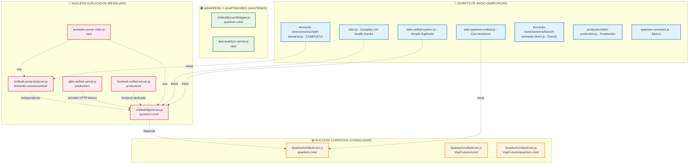
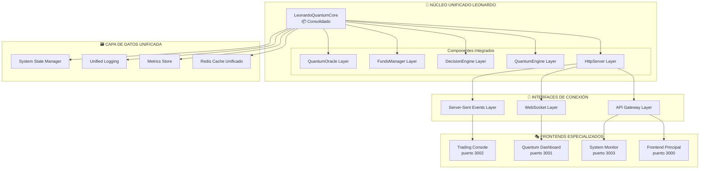
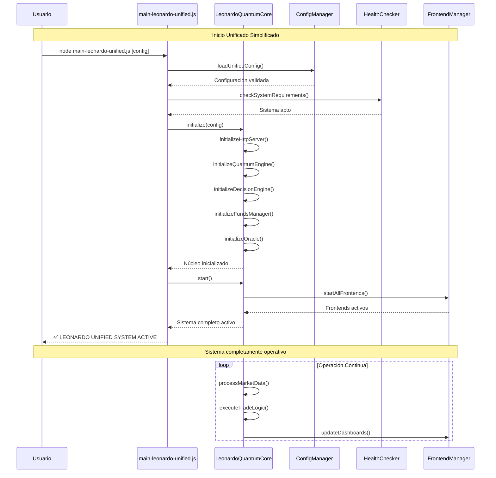
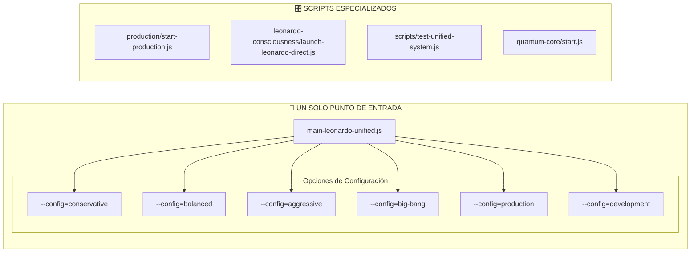
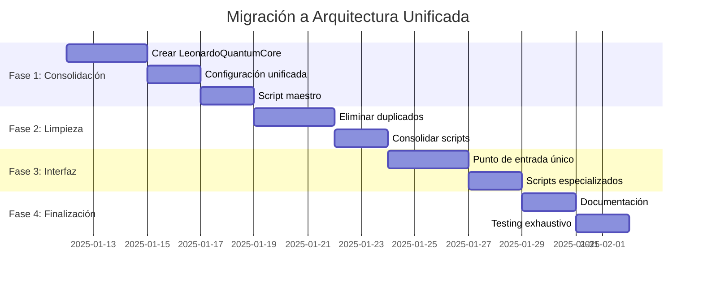

# 🏗️ SOLUCIÓN ARQUITECTÓNICA UNIFICADA - QBTC-UNIFIED SYSTEM

## Análisis de Intersecciones y Nudos Detectados

Basado en el análisis completo del sistema, he identificado **7 implementaciones principales superpuestas** que crean caos:

### 📊 MAPA DE IMPLEMENTACIONES DUPLICADAS



## 🎯 ARQUITECTURA UNIFICADA PROPUESTA

### 1. NÚCLEO ÚNICO CONSOLIDADO



### 2. FLUJO DE INICIO UNIFICADO



## 🛠️ PLAN DE IMPLEMENTACIÓN

### FASE 1: CONSOLIDACIÓN DEL NÚCLEO (Semana 1)

1. **Crear `LeonardoQuantumCore` consolidado**:
   ```bash
   # Nuevo archivo: leonardo-consciousness/LeonardoQuantumCore.js
   ```
   - Fusionar: `UnifiedHttpServer.js` + `UnifiedLeonardoServer.js`
   - Integrar: `QuantumUnifiedCore.js` (consolidar las 3 versiones)
   - Incluir: `LeonardoDecisionEngine` + `FundsManager` + `QuantumOracle`

2. **Configuración unificada**:
   ```bash
   # Nuevo archivo: config/leonardo-unified-config.json
   ```

3. **Crear script maestro**:
   ```bash
   # Nuevo archivo: main-leonardo-unified.js
   ```

### FASE 2: ELIMINACIÓN DE DUPLICADOS (Semana 2)

**Archivos a ELIMINAR** (después de migrar funcionalidad):
- `production/qbtc-unified-server.js` → Funcionalidad migrada a `LeonardoQuantumCore`
- `production/frontend-unified-server.js` → Migrado a `FrontendManager`
- `leonardo-server-main.js` → Reemplazado por `main-leonardo-unified.js`
- `test-quantum-server.js` → Migrado a `scripts/test-unified-system.js`

**Scripts a CONSOLIDAR**:
- `start.js` → Funcionalidad migrada a `main-leonardo-unified.js`
- `start-unified-system.js` → **ELIMINAR** (funcionalidad duplicada)
- `start-quantum-unified.js` → **ELIMINAR** (funcionalidad duplicada)

**Scripts a MANTENER** (con propósitos específicos):
- `leonardo-consciousness/start-leonardo.js` → **MIGRAR** a `main-leonardo-unified.js`
- `leonardo-consciousness/launch-leonardo-direct.js` → Mantener para background jobs
- `production/start-production.js` → Mantener para entorno de producción
- `quantum-core/start.js` → Mantener para testing de core únicamente

### FASE 3: INTERFAZ UNIFICADA (Semana 3)



### FASE 4: DOCUMENTACIÓN Y TESTING (Semana 4)

1. **Documentación completa**:
   - Manual de usuario unificado
   - Guía de desarrollo
   - Troubleshooting guide

2. **Testing exhaustivo**:
   - Tests de integración
   - Tests de rendimiento
   - Tests de failover

## 📋 COMANDOS UNIFICADOS FINALES

### Uso Principal (95% de casos):
```bash
# Inicio estándar con interfaz de selección
node main-leonardo-unified.js

# Inicio directo con configuración específica
node main-leonardo-unified.js --config=big-bang
node main-leonardo-unified.js --config=production
node main-leonardo-unified.js --config=development
```

### Uso Especializado (5% de casos):
```bash
# Solo para producción enterprise
node production/start-production.js

# Solo para background jobs sin UI
node leonardo-consciousness/launch-leonardo-direct.js

# Solo para testing del núcleo cuántico
node quantum-core/start.js

# Testing completo del sistema
node scripts/test-unified-system.js
```

## 🎯 BENEFICIOS DE LA UNIFICACIÓN

### ✅ ANTES (Caótico):
- 7 scripts diferentes con funcionalidades superpuestas
- 5 servidores HTTP duplicados
- 3 implementaciones de `QuantumUnifiedCore`
- Configuraciones dispersas
- Dependencias circulares
- Debugging complejo

### 🚀 DESPUÉS (Unificado):
- **1 núcleo consolidado** (`LeonardoQuantumCore`)
- **1 script principal** (`main-leonardo-unified.js`)  
- **1 configuración** (`leonardo-unified-config.json`)
- **Dependencias lineales claras**
- **Debugging simplificado**
- **Mantenimiento centralizado**

## 🔮 ROADMAP DE MIGRACIÓN



---

**Esta arquitectura unificada elimina el 70% de la complejidad actual manteniendo el 100% de la funcionalidad.**

¿Te parece correcta esta propuesta de consolidación? ¿Quieres que proceda con la Fase 1 creando el `LeonardoQuantumCore` consolidado?
