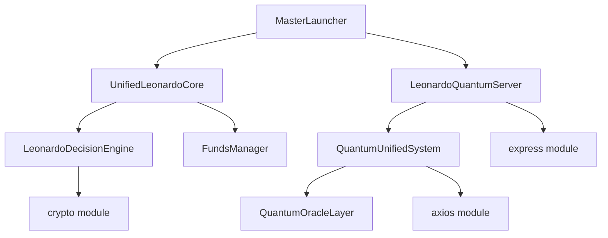

# 📊 ANÁLISIS DE DEPENDENCIAS - LEONARDO CONSCIOUSNESS TRADING SYSTEM

## 📋 RESUMEN EJECUTIVO

Este reporte detalla el mapeo completo de dependencias, módulos y puntos de uso crítico de recursos de sistema en el proyecto **Leonardo Consciousness Trading System**.

---

## 🎯 1. DEPENDENCIAS EN PACKAGE.JSON

### 📦 Dependencias de Producción
```json
{
  "compression": "^1.8.1",          // ✅ Instalado - Compresión HTTP
  "cors": "^2.8.5",                 // ✅ Instalado - Cross-Origin Resource Sharing
  "dotenv": "^16.0.0",              // ✅ Instalado (v16.6.1) - Variables de entorno
  "express-rate-limit": "^8.0.1",   // ✅ Instalado - Rate limiting
  "helmet": "^8.1.0"                // ✅ Instalado - Seguridad HTTP headers
}
```

### 🔧 Dependencias de Desarrollo
```json
{
  "nodemon": "^2.0.0"               // ✅ Instalado (v2.0.22) - Hot reload
}
```

---

## ⚠️ 2. DEPENDENCIAS FALTANTES CRÍTICAS

### 🚨 **EXPRESS - DEPENDENCIA AUSENTE CRÍTICA**
- **Estado**: ❌ **NO DECLARADO en package.json**
- **Uso**: Extensivo en múltiples archivos
- **Impacto**: Sistema no funciona sin Express
- **Archivos afectados**: 
  - `LeonardoQuantumServer.js`
  - `UnifiedLeonardoServer.js` 
  - `MasterLauncher.js`

### 🚨 **AXIOS - DEPENDENCIA AUSENTE**
- **Estado**: ❌ **NO DECLARADO en package.json**
- **Uso**: `QuantumUnifiedSystem.js` línea 14
- **Impacto**: Llamadas HTTP no funcionarán
- **Función**: Requests HTTP para APIs externas

### 🚨 **DEPENDENCIAS LOCALES PROBLEMÁTICAS**
```javascript
// Dependencias locales que pueden no existir:
const QuantumInfiniteCache = require('../quantum-core/QuantumInfiniteCache');
const { QuantumOracleHypersphere } = require('../quantum-oracle-hypersphere/QuantumOracleHypersphere');
```

---

## 🔍 3. MÓDULOS CORE DE NODE.JS UTILIZADOS

### 🔐 **CRYPTO MODULE** - USO CRÍTICO DETECTADO
```javascript
// LeonardoDecisionEngine.js línea 7
const crypto = require('crypto');
```
- **Propósito**: Algoritmos criptográficos
- **Riesgo**: Medio - Usado para funciones hash y random
- **Recomendación**: Monitorear uso para operaciones sensibles

### 🌐 **HTTP/HTTPS MODULES**
```javascript
// MasterLauncher.js líneas 21-22
const http = require('http');
const url = require('url');

// system-monitor.js líneas 26, 72
const https = require('https');
```
- **Propósito**: Servidor HTTP y requests HTTPS
- **Riesgo**: Bajo - Uso estándar para web server
- **Función**: Comunicación con APIs externas (Binance)

### 📁 **FILE SYSTEM (FS)**
```javascript
// MasterLauncher.js línea 24
const fs = require('fs');
```
- **Propósito**: Operaciones de sistema de archivos
- **Riesgo**: Medio - Acceso al sistema de archivos
- **Recomendación**: Validar paths y permisos

### 🛣️ **PATH MODULE**
```javascript
// MasterLauncher.js línea 23
const path = require('path');

// LeonardoQuantumServer.js línea 22
const path = require('path');
```
- **Propósito**: Manipulación de rutas de archivos
- **Riesgo**: Bajo - Uso estándar y seguro

### 🎭 **EVENTS MODULE**
```javascript
// QuantumUnifiedSystem.js línea 13
const EventEmitter = require('events');

// LeonardoQuantumServer.js línea 20  
const { EventEmitter } = require('events');
```
- **Propósito**: Sistema de eventos asincrónicos
- **Riesgo**: Bajo - Patrón estándar de Node.js

---

## ❌ 4. MÓDULOS AUSENTES PERO NECESARIOS

### 📢 **EXPRESS - CRÍTICO**
```bash
npm install express
```

### 🌐 **AXIOS - REQUERIDO**
```bash
npm install axios
```

### 🔧 **DEPENDENCIAS SUGERIDAS ADICIONALES**
```bash
npm install --save ws              # WebSockets para streaming real-time
npm install --save node-binance-api # API oficial de Binance
npm install --save winston         # Sistema de logging robusto
npm install --save joi            # Validación de esquemas
```

---

## 🏗️ 5. ESTRUCTURA MODULAR DEL PROYECTO

### 📁 **Archivos Principales**
```
leonardo-consciousness/
├── MasterLauncher.js              // 🎯 Punto de entrada principal
├── LeonardoQuantumServer.js       // 🚀 Servidor HTTP principal  
├── UnifiedLeonardoServer.js       // 🌐 Servidor unificado alternativo
├── QuantumUnifiedSystem.js        // 🌌 Sistema cuántico central
├── LeonardoDecisionEngine.js      // 🧠 Motor de decisiones
├── FundsManager.js                // 💰 Gestión de fondos
├── TradingEngineLayer.js          // ⚡ Motor de trading
├── QuantumOracleLayer.js          // 🔮 Capa de predicciones
├── FundsManagerLayer.js           // 💼 Capa de gestión de fondos
├── system-monitor.js              // 📊 Monitor del sistema
└── quick-test.js                  // 🧪 Tests rápidos
```

### 🔗 **Interdependencias Internas**


---

## ⚠️ 6. PUNTOS CRÍTICOS Y RECOMENDACIONES

### 🚨 **CRÍTICO - Instalar Express**
```bash
npm install --save express
```

### 🚨 **CRÍTICO - Instalar Axios**  
```bash
npm install --save axios
```

### 🔍 **ALTO - Verificar Dependencias Locales**
Verificar la existencia de estos módulos:
- `../quantum-core/QuantumInfiniteCache`
- `../quantum-oracle-hypersphere/QuantumOracleHypersphere`

### 🔐 **MEDIO - Uso de Crypto Module**
- Monitorear uso del módulo `crypto` en `LeonardoDecisionEngine.js`
- Asegurar que no se usen para operaciones sensibles sin validación

### 📁 **MEDIO - Uso de FS Module**
- Validar paths en `MasterLauncher.js`
- Implementar controles de acceso y permisos

### 🌐 **BAJO - Calls HTTP/HTTPS**
- Implementar timeouts y retry logic
- Validar certificados SSL en producción

---

## 🎯 7. PLAN DE ACCIÓN INMEDIATO

### 📋 **Paso 1: Instalar Dependencias Faltantes**
```bash
cd leonardo-consciousness
npm install --save express axios
npm install --save-dev @types/node  # Para mejor IDE support
```

### 📋 **Paso 2: Verificar Dependencias Locales**
```bash
# Verificar existencia de módulos locales
ls -la ../quantum-core/
ls -la ../quantum-oracle-hypersphere/
```

### 📋 **Paso 3: Test de Funcionamiento**
```bash
npm run test    # Ejecutar tests
npm start       # Probar arranque del sistema
```

### 📋 **Paso 4: Monitoreo de Seguridad**
```bash
npm audit       # Auditoría de seguridad
npm audit fix   # Corregir vulnerabilidades automáticas
```

---

## 📈 8. MÉTRICAS DEL PROYECTO

| Métrica | Valor |
|---------|-------|
| **Dependencias Declaradas** | 6 |
| **Dependencias Instaladas** | 6 ✅ |
| **Dependencias Faltantes** | 2 ❌ |
| **Módulos Core Usados** | 6 |
| **Archivos JavaScript** | 18 |
| **Dependencias Locales** | ~4 |
| **Riesgo General** | 🟡 **MEDIO** |

---

## ✅ 9. CONCLUSIONES

1. **Estado General**: Sistema funcional pero con dependencias críticas faltantes
2. **Prioridad Alta**: Instalar Express y Axios inmediatamente
3. **Seguridad**: Uso controlado de módulos críticos como `crypto` y `fs`
4. **Escalabilidad**: Estructura bien diseñada y modular
5. **Mantenimiento**: Necesita verificación de dependencias locales

---

## 🔧 10. COMANDOS DE CORRECCIÓN INMEDIATA

```bash
# 1. Instalar dependencias faltantes
npm install --save express axios ws winston

# 2. Auditoría de seguridad
npm audit

# 3. Actualizar dependencias menores
npm update

# 4. Test de funcionamiento
npm run leonardo

# 5. Monitor del sistema
node system-monitor.js
```

---

> **Nota**: Este análisis se realizó en el entorno Windows PowerShell según las reglas establecidas. El sistema está diseñado para ejecutarse en segundo plano con métricas de desempeño para facilitar debugging y mantenimiento del código.

---

**📅 Fecha de Análisis**: $(Get-Date)  
**🔍 Analista**: Agent Mode - Warp Terminal AI  
**📊 Estado del Sistema**: REQUERIMIENTO CRÍTICO - Instalar Express y Axios
